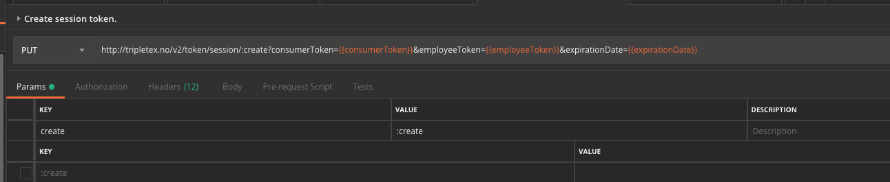

# API - Frequently asked questions and answers

On this page you will find some of the more common Q&A’s, the target demographic is developers integrating with the Tripletex API.

---

### What does the response “Object not found” mean?

#### Answer:

Most likely you are referring to an object without the internally assigned ID of the object. When you create i.e a customer and you want to post an order with this customer, you have to refer to the customer.Id. This relates to all objects in the Tripletex API.

If you want to know the ID of an object, GET the data from the relevant endpoint.

---

### How can I use the fields parameter to increase the effectivity of GET requests?

#### Answer:

This example is fetching orders via `/v2/order`. WIthout usage of fields you will get a dataset returned which includes information about the order objects, i.e our internal ID, order number, delivery date, ID of the customer on the order and a list of internal IDs of the orderlines.

This would suffice when you only want the data for the order. As an example, the API request is `GET /v2/order?orderDateFrom=2017-01-01&orderDateTo=2017-02-01`.

If you want the orderlines related to the order as well you can expand the API request by specifying fields like `*,orderLines(*)`. This means get all fields on order (`*`), as well as all fields on every orderline (`orderLines(*)`). This will return description, count, price etc on every orderline in addition to the internal ID. This API request is: `GET /v2/order?orderDateFrom=2017-01-01&orderDateTo=2017-02-01&fields=*,orderLines(*)`

---

### How can I correct the validation message “The unit price must be exclusive VAT since the unit price on the order is exclusive VAT.”

#### Answer:

The order object can be set to either accept orderlines including VAT or excluding VAT with the optional boolean value isPrioritizeAmountsIncludingVat. If you encounter this issue it would be a good idea to provide the value directly when creating an order and then using the appropriate price value on orderlines for the order.

Example:
if order is set to isPrioritizeAmountsIncludingVat = true then you should provide orderlines with only unitPriceIncludingVatCurrency.

---

### How can I find payment information for specific invoices via the API?

### Answer:

We are going to expand this with a new endpoint but in the meantime this method should work:

- find Invoice.customerId and invoice.number
- get all postings where customerId = Invoice.customerId
- locally find where invoiceNumber = invoice.number
- if any has closegroupId, then everything is paid or credited in full
- but you can sum all posts where invoiceNumber = invoice.number (betalinger)
- and if you have a closegroupId, you will have to get other postings with closegroupId to find related creditnotes

---

### Can I get hidden fields for our internal ID's or other information?

### Answer:

We inherently do not wish to support fields for this, we recommend that you instead save our ID's for your system and make the relation that way if possible.

---

### How do I create session tokens in Postman?

### Answer:

Postman treats `:create` as a "Postman parameter", and not a part of the URL. Since the value has not been defined, the resolved URL will be `/token/session/` rather than the intended `/token/session/:create`.

A workaround is to manually specify `create` as a parameter with the value `:create`. The resolved URL will then be correct.

---

### How and when do you update currency values in Tripletex?

### Answer:

We fetch currency data at 0610 and 1810 every day from https://data.norges-bank.no/api/data/EXR/B..NOK.SP?format=csv&lastNObservations=14&locale=en
